# Penetration Testing Plan: Ladder Legends Academy

## Executive Summary

This document outlines a comprehensive penetration testing plan for the Ladder Legends Academy platform. The application is a Next.js 15 web application with Discord OAuth authentication, role-based access control, and integrations with multiple third-party services.

---

## 1. Architecture Overview

### 1.1 System Component Diagram

```mermaid
graph TB
    subgraph "Client Layer"
        WEB[Web Browser]
        DESK[Desktop Uploader<br/>Tauri/Rust]
    end

    subgraph "Next.js Application"
        direction TB
        NEXT[Next.js 15 App Router]
        AUTH[Auth.js<br/>NextAuth v5]
        API[API Routes]
        PERM[Permission System]
    end

    subgraph "API Routes"
        direction TB
        API_AUTH[/api/auth/*]
        API_DEV[/api/auth/device/*]
        API_MUX[/api/mux/*]
        API_REPLAY[/api/my-replays/*]
        API_ADMIN[/api/admin/*]
        API_ANALYZE[/api/analyze-replay]
        API_SETTINGS[/api/settings]
    end

    subgraph "Data Storage"
        JSON[JSON Files<br/>src/data/*.json]
        BLOB[Vercel Blob<br/>Replay Files]
        KV[Vercel KV<br/>User Data]
    end

    subgraph "External Services"
        DISCORD[Discord API<br/>OAuth + Roles]
        GITHUB[GitHub API<br/>CMS Commits]
        MUX[Mux API<br/>Video Hosting]
        SC2[SC2Reader API<br/>Replay Analysis]
        POSTHOG[PostHog<br/>Analytics]
    end

    WEB --> NEXT
    DESK --> API

    NEXT --> AUTH
    NEXT --> API
    API --> PERM

    API --> API_AUTH
    API --> API_DEV
    API --> API_MUX
    API --> API_REPLAY
    API --> API_ADMIN
    API --> API_ANALYZE
    API --> API_SETTINGS

    API_AUTH --> DISCORD
    API_DEV --> KV
    API_MUX --> MUX
    API_REPLAY --> KV
    API_REPLAY --> BLOB
    API_REPLAY --> SC2
    API_ADMIN --> GITHUB
    API_SETTINGS --> KV

    NEXT --> JSON
    NEXT --> POSTHOG
```

### 1.2 Authentication Flow Diagram


### 1.3 Device Code Flow (Desktop Uploader)


### 1.4 Role-Based Access Control

```mermaid
graph LR
    subgraph "Role Hierarchy"
        O[Owner] --> M[Moderator]
        M --> C[Coach]
        C --> S[Subscriber]
        S --> P[Public]
    end

    subgraph "Permission Levels"
        PO[owners] --> PC[coaches]
        PC --> PS[subscribers]
    end

    subgraph "Protected Resources"
        ADMIN[Admin CMS<br/>coaches+]
        PREMIUM[Premium Content<br/>subscribers+]
        MY_REPLAYS[My Replays<br/>authenticated]
        PUBLIC[Public Content<br/>everyone]
    end

    O -.-> ADMIN
    C -.-> ADMIN
    S -.-> PREMIUM
    P -.-> PUBLIC
```



---

## 2. Attack Surface Analysis

### 2.1 API Endpoints Inventory

| Endpoint | Methods | Auth Required | Permission | Risk Level |
|----------|---------|---------------|------------|------------|
| `/api/auth/[...nextauth]` | GET, POST | None | None | HIGH |
| `/api/auth/device/code` | POST | None | None | MEDIUM |
| `/api/auth/device/poll` | GET | None | None | MEDIUM |
| `/api/auth/device/verify` | POST | Session | None | MEDIUM |
| `/api/auth/device/activate` | POST | Session | None | MEDIUM |
| `/api/my-replays` | GET, POST, DELETE | Auth | Authenticated | HIGH |
| `/api/my-replays/[id]` | GET, DELETE | Auth | Owner | HIGH |
| `/api/my-replays/index` | GET | Auth | Authenticated | MEDIUM |
| `/api/my-replays/check-hashes` | POST | Auth | Authenticated | MEDIUM |
| `/api/my-replays/references` | GET, POST | Auth | Authenticated | MEDIUM |
| `/api/settings` | GET, POST | Auth | Authenticated | MEDIUM |
| `/api/admin/commit` | POST | Session | Coach+ | CRITICAL |
| `/api/admin/checkup` | GET | Session | Coach+ | LOW |
| `/api/admin/discord-sync` | POST | Session | Coach+ | MEDIUM |
| `/api/mux/upload` | POST | Session | Coach+ | HIGH |
| `/api/mux/playback` | POST | Session | Subscriber+ | MEDIUM |
| `/api/mux/webhook` | POST | Mux Signature | None | HIGH |
| `/api/analyze-replay` | POST | Auth | Authenticated | MEDIUM |
| `/api/upload-replay` | POST | Session | Coach+ | HIGH |
| `/api/replay-download` | GET | Auth | Varies | MEDIUM |
| `/api/posthog/[...path]` | ALL | None | None | LOW |

---

## 3. Risk Areas (Prioritized)

### Priority 1: CRITICAL (Test First)

#### 3.1.1 JWT Token Security
**Location:** `src/lib/api-auth.ts:40-78`

**Risks:**
- [ ] JWT secret strength (AUTH_SECRET)
- [ ] Token expiration not enforced?
- [ ] Token type validation bypass
- [ ] Algorithm confusion attack (alg: none)
- [ ] Key leakage in error messages

**Test Cases:**
```bash
# Test 1: Expired token acceptance
curl -X POST /api/my-replays \
  -H "Authorization: Bearer <expired_token>"

# Test 2: Invalid signature
curl -X POST /api/my-replays \
  -H "Authorization: Bearer <tampered_token>"

# Test 3: Wrong token type
curl -X POST /api/my-replays \
  -H "Authorization: Bearer <session_token_not_uploader>"

# Test 4: Algorithm confusion
# Generate token with alg:none and verify if accepted
```

#### 3.1.2 Admin CMS - Arbitrary Code Execution
**Location:** `src/app/api/admin/commit/route.ts`

**Risks:**
- [ ] Path traversal in file paths (e.g., `../../.env`)
- [ ] JSON injection in content
- [ ] Command injection via commit message
- [ ] Overwrite critical files (package.json, next.config.js)
- [ ] Bypass permission checks

**Test Cases:**
```bash
# Test 1: Path traversal
curl -X POST /api/admin/commit -d '{
  "changes": [{
    "contentType": "file",
    "operation": "create",
    "data": {
      "path": "../../../.env",
      "content": "data:text/plain;base64,SEVMTE8="
    }
  }]
}'

# Test 2: Overwrite package.json
curl -X POST /api/admin/commit -d '{
  "changes": [{
    "contentType": "file",
    "operation": "create",
    "data": {
      "path": "package.json",
      "content": "..."
    }
  }]
}'
```

#### 3.1.3 IDOR in My Replays
**Location:** `src/app/api/my-replays/[id]/route.ts`

**Risks:**
- [ ] Access other users' replays by ID guessing
- [ ] Delete other users' replays
- [ ] Discord ID spoofing in JWT

**Test Cases:**
```bash
# Test 1: Access another user's replay
# User A's replay ID: abc123
# User B tries to access it
curl -X GET /api/my-replays/abc123 \
  -H "Authorization: Bearer <user_b_token>"

# Test 2: Delete another user's replay
curl -X DELETE /api/my-replays/abc123 \
  -H "Authorization: Bearer <user_b_token>"
```

#### 3.1.4 Mux Webhook Signature Bypass
**Location:** `src/app/api/mux/webhook/route.ts:44-48`

**Risks:**
- [ ] Webhook processing WITHOUT signature verification when `MUX_WEBHOOK_SECRET` is not set
- [ ] Forge webhook events to mark videos as ready
- [ ] Inject malicious data via webhook payload

**Test Cases:**
```bash
# Test 1: Forge webhook without signature
curl -X POST /api/mux/webhook \
  -H "Content-Type: application/json" \
  -d '{"type": "video.asset.ready", "data": {"id": "attacker-asset"}}'
```

---

### Priority 2: HIGH

#### 3.2.1 Role Emulation in Production
**Location:** `src/lib/permissions.ts:20-47`

**Risks:**
- [ ] `NODE_ENV` can be manipulated
- [ ] Environment variable injection
- [ ] NEXT_PUBLIC_EMULATE_ROLE accessible client-side

**Test Cases:**
```bash
# Verify role emulation is disabled in production
# Check if NEXT_PUBLIC_EMULATE_ROLE can be set via request headers
```

#### 3.2.2 Device Code Brute Force
**Location:** `src/app/api/auth/device/code/route.ts`

**Risks:**
- [ ] User code is only 8 characters (after hyphen removal)
- [ ] No rate limiting on code generation
- [ ] No rate limiting on verification attempts
- [ ] Code enumeration via timing attacks

**Test Cases:**
```bash
# Test 1: Generate many codes
for i in {1..1000}; do
  curl -X POST /api/auth/device/code \
    -d '{"client_id": "ladder-legends-uploader"}'
done

# Test 2: Brute force user codes
# 8 chars from 32-char alphabet = 32^8 = ~1 trillion combinations
# But with rate limiting issues, could be faster
```

#### 3.2.3 File Upload Vulnerabilities
**Location:** `src/app/api/my-replays/route.ts`, `src/app/api/upload-replay/route.ts`

**Risks:**
- [ ] File size limits (60 second timeout suggests large files)
- [ ] File type validation (SC2Replay only?)
- [ ] Malicious replay file parsing (buffer overflow in sc2reader)
- [ ] Path traversal in filename
- [ ] Zip slip in replay files

**Test Cases:**
```bash
# Test 1: Upload non-replay file
curl -X POST /api/my-replays \
  -F "file=@malicious.exe"

# Test 2: Upload oversized file
dd if=/dev/zero of=huge.SC2Replay bs=1M count=500
curl -X POST /api/my-replays \
  -F "file=@huge.SC2Replay"

# Test 3: Malformed replay to crash parser
curl -X POST /api/my-replays \
  -F "file=@crafted_malicious.SC2Replay"
```

#### 3.2.4 GitHub Token Scope
**Location:** `src/app/api/admin/commit/route.ts`

**Risks:**
- [ ] Token with excessive permissions
- [ ] Token can access other repos
- [ ] Token can delete branches/releases

**Test Cases:**
```bash
# Verify token scope via GitHub API
# Check if token can:
# - Access other repositories
# - Push to protected branches
# - Create/delete releases
```

---

### Priority 3: MEDIUM

#### 3.3.1 Session Fixation
**Location:** `src/lib/auth.ts`

**Risks:**
- [ ] Session ID not rotated after login
- [ ] Session cookies without Secure flag
- [ ] Session cookies without HttpOnly flag

#### 3.3.2 CSRF Protection
**Risks:**
- [ ] Verify CSRF tokens on state-changing operations
- [ ] Check SameSite cookie attribute

#### 3.3.3 Rate Limiting
**Risks:**
- [ ] No rate limiting on authentication endpoints
- [ ] No rate limiting on file upload
- [ ] No rate limiting on API calls

#### 3.3.4 Information Disclosure
**Risks:**
- [ ] Error messages reveal internal paths
- [ ] Stack traces in production
- [ ] API key exposure in client-side code
- [ ] Source maps enabled in production

#### 3.3.5 PostHog Proxy
**Location:** `src/app/api/posthog/[...path]/route.ts`

**Risks:**
- [ ] Open proxy to PostHog
- [ ] Could be used to exfiltrate data
- [ ] No request validation

---

### Priority 4: LOW

#### 3.4.1 Content Security Policy
- [ ] CSP headers configured
- [ ] Script-src restrictions
- [ ] Object-src restrictions

#### 3.4.2 CORS Configuration
- [ ] Allowed origins list
- [ ] Credentials handling

#### 3.4.3 HTTP Security Headers
- [ ] X-Frame-Options
- [ ] X-Content-Type-Options
- [ ] Referrer-Policy
- [ ] Permissions-Policy

---

## 4. Test Methodology

### 4.1 Pre-Engagement

1. **Scope Definition**
   - All API endpoints in `/api/*`
   - Client-side authentication flows
   - Role-based access control
   - Third-party integrations

2. **Rules of Engagement**
   - Use test environment only (academy-test repo)
   - No load testing without approval
   - No data exfiltration
   - Document all findings

### 4.2 Testing Phases


### 4.3 Tools Required

| Tool | Purpose |
|------|---------|
| Burp Suite | HTTP interception, request modification |
| jwt_tool | JWT analysis and exploitation |
| ffuf | Fuzzing and brute forcing |
| Postman | API testing |
| curl | Manual HTTP requests |
| SQLMap | SQL injection testing (if applicable) |

---

## 5. Verification Checklist

### 5.1 Authentication (AUTH)

- [ ] AUTH-01: Session cookie security flags
- [ ] AUTH-02: JWT signature verification
- [ ] AUTH-03: JWT expiration enforcement
- [ ] AUTH-04: Token type validation
- [ ] AUTH-05: OAuth state parameter validation
- [ ] AUTH-06: Device code expiration
- [ ] AUTH-07: Device code rate limiting
- [ ] AUTH-08: Session invalidation on logout
- [ ] AUTH-09: Concurrent session handling
- [ ] AUTH-10: Password/credential storage (N/A - OAuth only)

### 5.2 Authorization (AUTHZ)

- [ ] AUTHZ-01: Role hierarchy enforcement
- [ ] AUTHZ-02: IDOR on user resources
- [ ] AUTHZ-03: Horizontal privilege escalation
- [ ] AUTHZ-04: Vertical privilege escalation
- [ ] AUTHZ-05: Role emulation disabled in prod
- [ ] AUTHZ-06: Permission checks on all endpoints
- [ ] AUTHZ-07: Admin function access control
- [ ] AUTHZ-08: Resource ownership validation

### 5.3 Input Validation (INPUT)

- [ ] INPUT-01: File upload type validation
- [ ] INPUT-02: File upload size limits
- [ ] INPUT-03: File upload path traversal
- [ ] INPUT-04: JSON payload validation
- [ ] INPUT-05: Query parameter injection
- [ ] INPUT-06: Header injection
- [ ] INPUT-07: Path traversal in API routes

### 5.4 Cryptography (CRYPTO)

- [ ] CRYPTO-01: JWT algorithm confusion
- [ ] CRYPTO-02: Weak JWT secret
- [ ] CRYPTO-03: TLS configuration
- [ ] CRYPTO-04: Sensitive data encryption

### 5.5 Configuration (CONFIG)

- [ ] CONFIG-01: Debug mode disabled
- [ ] CONFIG-02: Error handling
- [ ] CONFIG-03: Security headers
- [ ] CONFIG-04: CORS policy
- [ ] CONFIG-05: CSP policy
- [ ] CONFIG-06: Source maps disabled

### 5.6 Third-Party (THIRD)

- [ ] THIRD-01: Mux webhook signature
- [ ] THIRD-02: GitHub token scope
- [ ] THIRD-03: Discord OAuth security
- [ ] THIRD-04: SC2Reader input validation
- [ ] THIRD-05: PostHog proxy restrictions

---

## 6. Reporting Template

### Finding Format

```markdown
### [SEVERITY] Finding Title

**ID:** VULN-XXX
**Location:** `file:line`
**CVSS Score:** X.X

**Description:**
[Detailed description of the vulnerability]

**Impact:**
[Business and technical impact]

**Proof of Concept:**
[Steps to reproduce]

**Remediation:**
[Specific fix recommendations]

**References:**
- [CWE-XXX](https://cwe.mitre.org/...)
- [OWASP](https://owasp.org/...)
```

---

## 7. Immediate Findings (Pre-Test)

### 7.1 CRITICAL: Mux Webhook Without Signature Verification

**ID:** VULN-001
**Location:** `src/app/api/mux/webhook/route.ts:44-48`
**CVSS Score:** 8.6 (High)

**Description:**
The Mux webhook handler processes events WITHOUT signature verification when `MUX_WEBHOOK_SECRET` is not configured. The code explicitly allows this with a warning comment.

```typescript
// If no webhook secret is configured, process without verification
// WARNING: In production, you should always verify webhooks!
const event = JSON.parse(body);
return handleWebhookEvent(event);
```

**Impact:**
- Attackers can forge webhook events
- Could mark malicious content as "ready"
- Could trigger unintended application behavior

**Remediation:**
- REQUIRE `MUX_WEBHOOK_SECRET` in production
- Return 500 error if webhook secret is not configured in production
- Add environment check: `if (!process.env.MUX_WEBHOOK_SECRET && process.env.NODE_ENV === 'production')`

---

### 7.2 HIGH: No Rate Limiting on Device Code Endpoints

**ID:** VULN-002
**Location:** `src/app/api/auth/device/code/route.ts`
**CVSS Score:** 5.3 (Medium)

**Description:**
The device code generation endpoint has no rate limiting. Attackers could:
1. Generate thousands of device codes to exhaust KV storage
2. Brute force user codes (8 characters from 32-char alphabet)

**Remediation:**
- Add rate limiting (e.g., 5 requests per IP per minute)
- Implement exponential backoff on verification failures
- Consider IP-based lockout after failed attempts

---

### 7.3 MEDIUM: HARDCODED_USER_ID Bypass in Production

**ID:** VULN-003
**Location:** `src/lib/auth.ts:68-76`
**CVSS Score:** 6.5 (Medium)

**Description:**
The hardcoded user override is controlled by environment variables that could potentially be set in production if misconfigured:

```typescript
const HARDCODED_USER_ID = process.env.HARDCODED_USER_ID || "";
if (HARDCODED_USER_ID && token.discordId === HARDCODED_USER_ID) {
  const hardcodedRole = process.env.HARDCODED_ROLE || "";
  // ... assigns roles without Discord verification
}
```

**Remediation:**
- Add explicit production check: `if (process.env.NODE_ENV !== 'production')`
- Remove or comment out this code in production builds
- Add deployment checks to ensure these env vars are not set

---

## 8. Next Steps

1. **Set up test environment** using `ladder-legends-academy-test` repo
2. **Configure test Discord server** with appropriate roles
3. **Generate test JWT tokens** for different user types
4. **Execute Priority 1 tests** first (JWT, Admin CMS, IDOR, Webhook)
5. **Document all findings** using the template above
6. **Provide remediation guidance** for each finding
7. **Re-test after fixes** to verify remediation

---

## Appendix A: Test User Matrix

| User Type | Discord ID | Roles | JWT Claims | Test Purpose |
|-----------|------------|-------|------------|--------------|
| Owner | test-owner | 1386739785283928124 | type: uploader, roles: [owner] | Full admin access |
| Coach | test-coach | 1387372036665643188 | type: uploader, roles: [coach] | CMS access |
| Subscriber | test-sub | 1387076312878813337 | type: uploader, roles: [subscriber] | Premium content |
| Member | test-member | (none) | type: uploader, roles: [] | Basic access |
| Attacker | attacker | (forged) | type: uploader, roles: [owner] | Privilege escalation |

---

## Appendix B: Environment Variables to Audit

| Variable | Risk | Check |
|----------|------|-------|
| AUTH_SECRET | Key strength | Minimum 32 bytes, cryptographically random |
| GITHUB_TOKEN | Scope | Minimum required permissions only |
| MUX_WEBHOOK_SECRET | Required | MUST be set in production |
| HARDCODED_USER_ID | Disable | MUST be empty in production |
| HARDCODED_ROLE | Disable | MUST be empty in production |
| NEXT_PUBLIC_EMULATE_ROLE | Disable | MUST be empty in production |
| NODE_ENV | Correct | MUST be "production" in prod |
